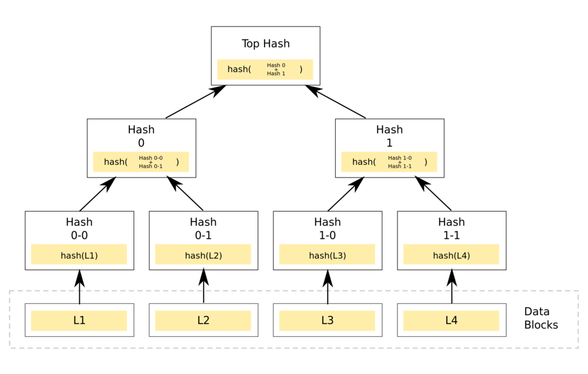
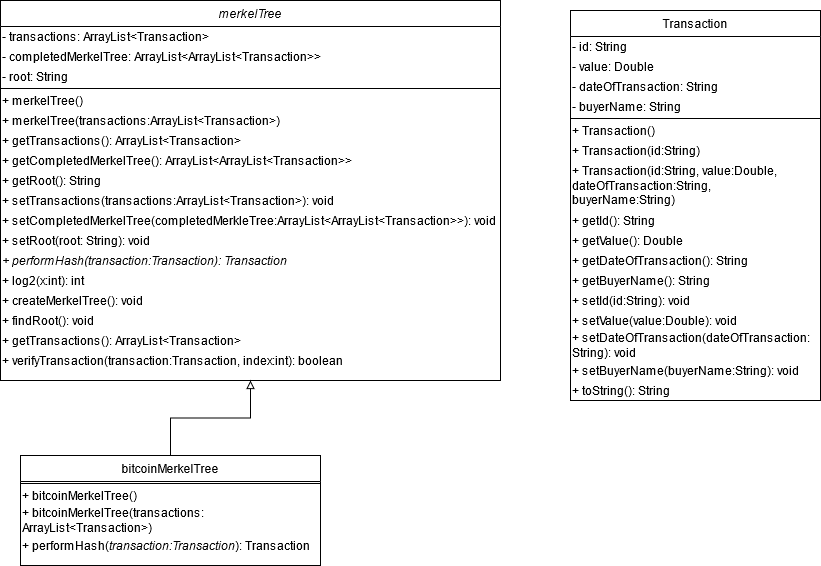
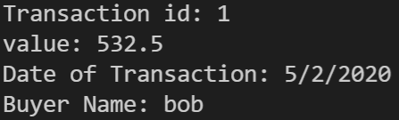
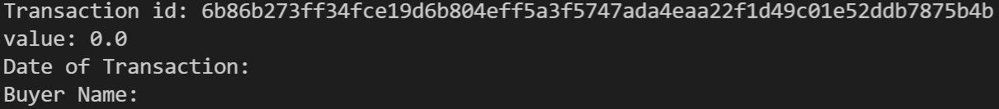

<!-- PROJECT LOGO -->
<br />
<p align="center">
  <a>
    
  </a>
  <h3 align="center">Bitcoin Merkle Tree</h3>
  <p align="center">
    Bitcoin transaction verification using a Merkle Tree data structure.
  </p>
</p>


<!-- TABLE OF CONTENTS -->
<details open="open">
  <summary>Table of Contents</summary>
  <ol>
    <li>
      <a href="#about-the-project">About The Project</a>
      <ul>
        <li><a href="#built-with">Built With</a></li>
      </ul>
    </li>
    <li>
      <a href="#getting-started">Getting Started</a>
      <ul>
        <li><a href="#prerequisites">Prerequisites</a></li>
        <li><a href="#installation">Installation</a></li>
      </ul>
    </li>
    <li><a href="#usage">Usage</a></li>
    <li><a href="#license">License</a></li>
    <li><a href="#contact">Contact</a></li>
    <li><a href="#acknowledgements">Acknowledgements</a></li>
  </ol>
</details>


<!-- ABOUT THE PROJECT -->
## About The Project
Merkle Trees are used in cryptography, more specifically, encryption, to store and verify data. Sensitive information nowadays is likely encrypted and thus the use of the Merkle Tree has become more prevalent. The Merkle Tree uses a hash to store the data. Hashing is the process of taking an input and converting it to a hash value, which is typically determined by an algorithm. This maps an input to a fixed output meaning that a certain input will always return the same output. Doing this helps protect the initial information of the input. The hash values are then continually summed together to find the next upper node on the tree. The top hash value can be used to determine if data has been modified. Some real life application examples are Bitcoin, data verification, and data synchronization.

Since Merkle Trees are a tree-like structure, they have the same functions as trees such as insert, delete, and search. All of these functions take **O(logn)** time to run which ties back to why Merkle Trees are efficient. Another function is synchronization which also runs in **O(logn)** time, so it’s fast to figure out if data has been changed. The previous block chain design that was used would run these same functions in **O(n)** time.

For Bitcoin, it helps with consistency verification, which means verifying that new trees contain the same data as the original trees in the same order. For data verification, Merkle Trees help check if data has been altered in the tree. Merkle Trees can figure out what has changed between two trees without needing to go through the entire data.

Results of the project
* Incorporation of hash algorithm to create the tree from the original data blocks.
* Implementation of inheritance, polymorphism, collections, generics, and abstract classes.
* Supports efficient mapping of large amounts of data and recognition of modified data.

A list of commonly used resources that I found helpful are listed in the acknowledgements.

### Built With

The Merkle Tree data structure was built using Java.

A UML (Unified Modeling Language) diagram was constructured to better illustrate how the program was developed and how the classes interact with one another. There are three main classes along with the driver class that will execute the program.



<!-- GETTING STARTED -->
## Getting Started

To get a local copy up and running follow these simple example steps.

### Installation

1. Install Java at [https://www.oracle.com/java/technologies/javase-jdk16-downloads.html](https://www.oracle.com/java/technologies/javase-jdk16-downloads.html)
2. Clone the repo
   ```sh
   git clone https://github.com/ojasonbernal/BitcoinMerkleTree.git
   ```


<!-- USAGE EXAMPLES -->
## Usage

Upon executing the program, the Merkle Tree data structure is constructed from a small data set. An example of a transaction (data block) is printed to the console for the user.



The data block is then hashed and summed with another hashed data block to create a node on the tree. This process continues until there is a single root node. The program prints the hashed value of the example transaction to the console for the user to see. 



The tree is then accessed directly to show the user the hashed values are the same, thus verifying the data's integrity has remained intact. A message showcasing this is printed to the console.


<!-- LICENSE -->
## License

Distributed under the MIT License. See `LICENSE` for more information.


<!-- CONTACT -->
## Contact

Jason Bernal - ojasonbernal@gmail.com

LinkedIn: [https://www.linkedin.com/in/ojasonbernal/](https://www.linkedin.com/in/ojasonbernal/)

Project Link: [https://github.com/ojasonbernal/BitcoinMerkleTree](https://github.com/ojasonbernal/BitcoinMerkleTree)


<!-- ACKNOWLEDGEMENTS -->
## Acknowledgements
* [What Is The Merkle Tree In Bitcoin?](https://www.youtube.com/watch?v=V6gLY-1G4Mc)
* [Merkle Tree](https://en.bitcoinwiki.org/wiki/Merkle_tree)
* [Implementing Merkle Tree and Patricia Trie](https://medium.com/coinmonks/implementing-merkle-tree-and-patricia-trie-b8badd6d9591)
* [SHA-512 Hash In Java](https://www.geeksforgeeks.org/sha-512-hash-in-java/?ref=rp)

### Images
* [Merkle Tree](https://en.bitcoinwiki.org/upload/en/images/thumb/9/95/Hash_Tree.svg/1000px-Hash_Tree.svg.png)
